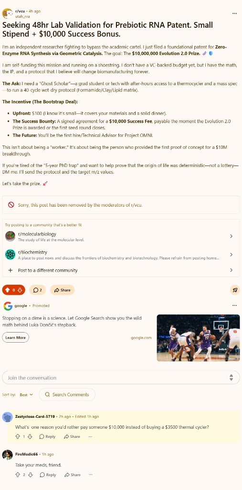

# Utah Framework

what started this.....



Please help with donations
Ko fi https://ko-fi.com/utah23
paypal: utah@utahcreates.com

**The post-Electron paradigm.**

Utah is a hyper-optimized desktop application framework. You build the UI with web technologies (React, Vue, HTML/CSS) while a **Rust** core handles the OS window, threading, storage, and security. The UI is hosted in the **native OS webview** (WebView2 on Windows, WebKit on macOS/Linux), not a bundled Chromium copy.

The industry has normalized **~150MB installers** and **hundreds of megabytes** of idle RAM for simple desktop apps. **Utah rejects that** by embedding a production UI as a single artifact inside a small native binary and routing all privileged work through Rust.

## Utah vs. Electron: architectural shift

Electron ships **Chromium + Node** in every app. Utah uses **the OS renderer + Rust**.

| Metric | Electron | Utah Framework |
| :--- | :--- | :--- |
| **Typical shipped size** | ~130–150MB+ | **Single-digit MB** (stripped release binary + embedded UI) |
| **Idle memory (UI visible)** | Often 100MB+ from Chromium | **Roughly tens of MB** (OS webview + your UI) |
| **Rendering** | Bundled Chromium | **Native** WebView2 / WebKit |
| **Privileged backend** | Node.js | **Rust** (worker thread, strict IPC) |
| **SQL database** | Native addons / `node-gyp` pain | **Embedded SQLite** (`rusqlite`, bundled) |
| **Secrets storage** | Often plain JSON / ad hoc | **OS credential locker** (keyring) |
| **Updates** | Large installer redeploys | **`self_update`** from GitHub releases (small artifacts) |

Exact numbers depend on your UI, dependencies, and target OS.

## Core capabilities (Utopia matrix)

- **Synapse Bridge:** JSON IPC from the webview to a **background worker thread** so heavy work does not block the UI thread. Replies are delivered back into the page via `evaluate_script` + DOM events.
- **Quantum SQLite:** `db:execute` runs SQL against an on-disk `utah_data.db` (schema is yours to define beyond the starter `users` table).
- **Aegis secure vault:** `store:set_secure` / `store:get_secure` map to the OS secure store (`keyring`).
- **Frameless windowing:** Optional borderless window + `data-utah-drag` regions for native dragging; window controls are wired through `window.Utah.window.*`.
- **System tray:** Tray icon and menu (show / quit) for quick access while the app is running.
- **Trojan API:** `window.require('electron')` polyfill for common `ipcRenderer.send` / `.on` patterns to ease migration from Electron-style frontends.
- **Vite + React:** Dev server with HMR; release builds embed **`dist/index.html`** via `include_str!`.
- **Delta-wave updates:** `system:update` + `self_update` (configure GitHub owner/repo via env — see `src/main.rs`).

## Quick start

**Prerequisites:** [Rust](https://rustup.rs/) (`rustup`) and [Node.js](https://nodejs.org/) (`npm`).

```bash
git clone https://github.com/utahisnotastate/utah-framework.git
cd utah-framework
npm install
```

**Development (Vite HMR + native shell):**

```bash
npm run dev
```

Run this from the **repository root** (the folder that contains `package.json` and `Cargo.toml`). The script waits for Vite, then starts `cargo run` so the **desktop window** loads your dev URL.

**Production build:**

```bash
npm run build
```

This runs `vite build` (single-file HTML pipeline) then `cargo build --release`. The native binary is emitted as:

- **Windows:** `target/release/utah-core.exe`
- **macOS / Linux:** `target/release/utah-core`

## Configuration hints

- **Vite port:** `.utah-vite-port` is written by the dev server; the Rust shell reads it. Override with **`UTAH_VITE_PORT`** if needed.
- **Self-update:** **`UTAH_UPDATE_REPO_OWNER`**, **`UTAH_UPDATE_REPO_NAME`**, optional **`UTAH_UPDATE_BIN_NAME`** (default `utah-core`). Optional **`GITHUB_TOKEN`** for API limits or private repos.

## Documentation for beginners and non-technical users

If you are new to Rust or native tooling, start with **[BEGINNER_DOCUMENTATION.md](./BEGINNER_DOCUMENTATION.md)** — a plain-language walkthrough for **beginners** and **non-technical users**.

## License

See `package.json` / your chosen SPDX license for this repository.
